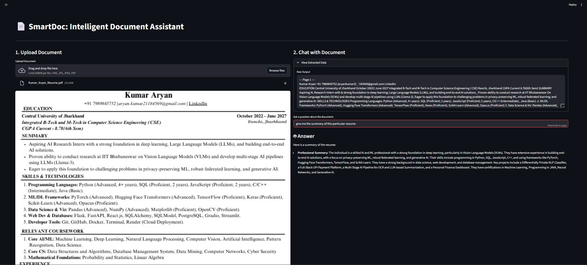

📄 SmartDoc AI: Intelligent Document Analysis & RAG Tool

SmartDoc AI is a multimodal document assistant that transforms static documents (PDFs, Images) into interactive, searchable data. It combines robust OCR pipelines with Large Language Models (LLMs) to allow users to "chat" with their resumes, invoices, and technical reports in real-time.

🚀 Key Features
1. Multi-Format Support: Seamlessly processes PDFs (multi-page) and Images (JPG/PNG).

2. Dual-Engine OCR Architecture:

    EasyOCR: Optimized for raw text extraction and fast processing (Resumes, Letters).

    ChandraOCR: Specialized for preserving complex table structures and layouts (Invoices, Datasheets).

3. AI Reasoning Layer: Integrated with NVIDIA Nemotron-70B to provide context-aware answers, summarization, and sentiment analysis.

4. Privacy-Focused RAG: Implements Retrieval-Augmented Generation (RAG) by processing documents locally and only sending relevant context to the LLM.

5. Interactive UI: Built with Streamlit for a responsive, user-friendly web interface.

🛠️ Tech Stack

   -> Language: Python 3.9+

   -> Frontend: Streamlit

   -> OCR Engines: EasyOCR, PyMuPDF (Fitz), ChandraOCR

   -> LLM Integration: NVIDIA API (Nemotron-70B-Instruct) via OpenAI SDK

   -> Image Processing: OpenCV, NumPy

   -> Environment Management: Python Dotenv

📂 Project Structure

    smartdoc-ai/

    ├── assets/              
    │   └── app_screenshot.png

    ├── src/                 
    │   ├── ocr_engine.py

    │   └── llm_engine.py

    ├── data/   
    │   ├── outputs

    │   └── uploads          # Your uploaded documents goes here   

    ├── .env                 # API Keys 

    ├── .gitignore           # Git rules

    ├── app.py               # Main App        

    ├── README.md            # Documentation

    └── requirements.txt     # contains all libraries that needs to be installed

⚙️ Installation & Setup

Follow these steps to run the project locally.

1. Clone the Repository
   
    git clone https://github.com/aaryansky/smartdoc-ai.git
    cd smartdoc-ai

2. Create a Virtual Environment
    python -m venv venv
    # Windows
    venv\Scripts\activate
    # Mac/Linux
    source venv/bin/activate

3. Install Dependencies
   
    pip install -r requirements.txt

4. Configure API Keys
   
   Create a file named .env in the root directory and add your NVIDIA API key:
   
    NVIDIA_API_KEY=nvapi-xxxxxxxxxxxxxxxxxxxxxxxxxxxxx

5. Run the Application
   
    streamlit run app.py

📖 How to Use

1. Select OCR Mode:

    Choose EasyOCR for standard text documents (Resumes, Essays).

    Choose ChandraOCR if your document has complex tables (Invoices, Bank Statements).

2. Upload Document: Drag and drop your PDF or Image file.

3. Extract Text: Click the "Extract Text" button to digitize the content.

4. Chat: Ask questions like:

    "Summarize this candidate's skills."

    "What is the total amount due in this invoice?"

🔮 Future Improvements

-> Vector Database: Implement FAISS or ChromaDB to handle large, multi-document querying.

-> History Session: Allow users to save chat history across sessions.

-> Export: Option to download the extracted text as .txt or .json.

🤝 Contributing

Contributions are welcome! Please fork the repository and create a pull request for any feature updates.

Author

Kumar Aryan Passionate about AI, Machine Learning, and Building Useful Tools. https://www.linkedin.com/in/kumar-aryan-6250a125a/
